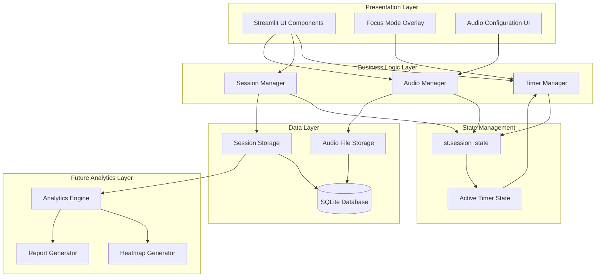
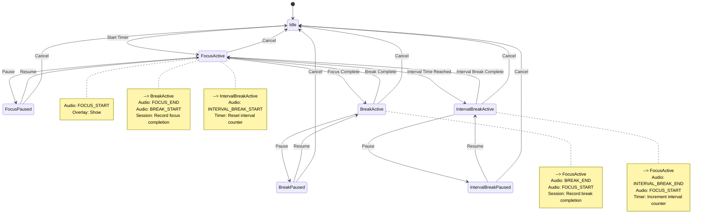
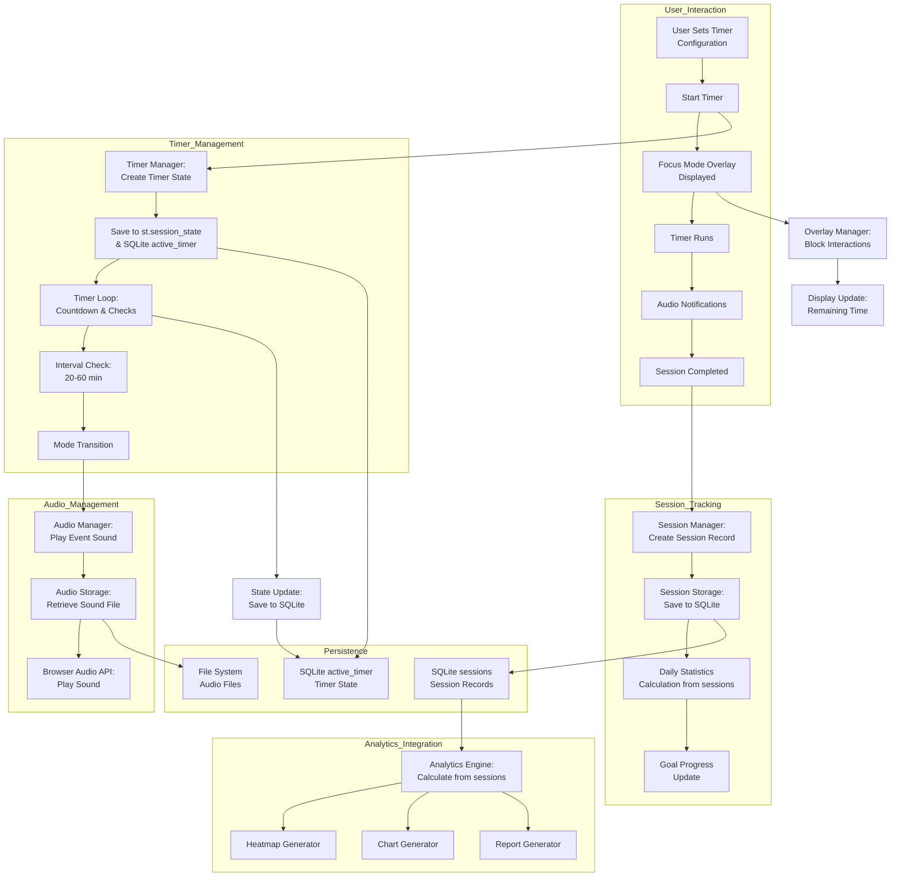
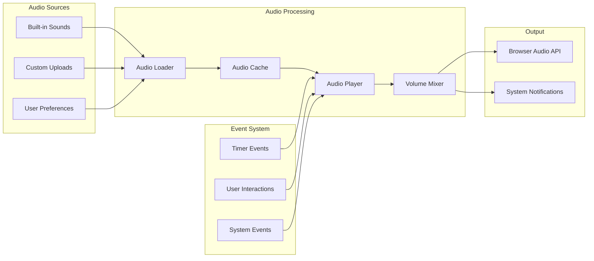
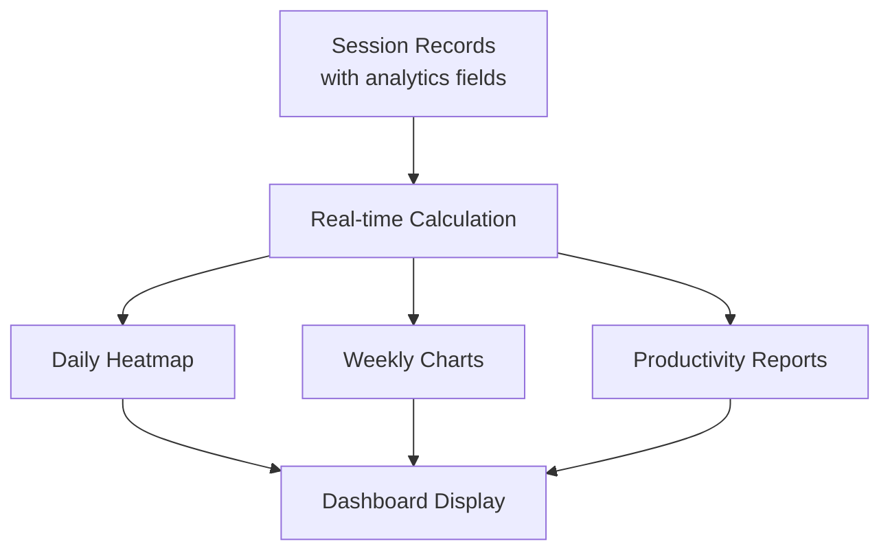

# Design Document: Timer + Session Core Module

## Overview

The Timer + Session Core Module is the foundational component of the PAUSE productivity application, providing timer management, session tracking, and audio notification capabilities. This module serves as the single source of truth for all timer and session data, enabling future analytics features including heatmaps, dashboards, and productivity reports. Built on a Streamlit frontend with Python backend and SQLite database, the architecture emphasizes data persistence, real-time state management, and extensibility for analytics integration.

## Architecture

The system follows a simplified layered architecture with clear separation between presentation, business logic, and data persistence layers. All data persistence uses SQLite database with st.session_state for active timer state management:



## Components and Interfaces

### Component 1: Timer Manager

**Purpose**: Manages all timer operations including focus sessions, breaks, and interval breaks with state transitions and persistence.

**Interface**:
```pascal
INTERFACE TimerManager
  METHOD startTimer(duration: Integer, mode: TimerMode): TimerID
  METHOD pauseTimer(timerId: TimerID): Boolean
  METHOD resumeTimer(timerId: TimerID): Boolean
  METHOD completeTimer(timerId: TimerID): SessionData
  METHOD cancelTimer(timerId: TimerID): Boolean
  METHOD getRemainingTime(timerId: TimerID): Integer
  METHOD getCurrentMode(timerId: TimerID): TimerMode
  METHOD isTimerActive(timerId: TimerID): Boolean
END INTERFACE

TYPE TimerMode = ENUM
  FOCUS
  BREAK
  INTERVAL_BREAK
END TYPE
```

**Responsibilities**:
- Manage timer state transitions (Start → Pause → Resume → Complete/Cancel)
- Enforce duration constraints (Focus: 30-120 min, Break: 10-60 min, Interval Break: 1-30 min)
- Handle interval break scheduling based on frequency (20-60 min)
- Coordinate with Audio Manager for notification events
- Persist timer state across page refreshes

### Component 2: Session Manager

**Purpose**: Tracks completed sessions, manages daily goals, and provides session summaries for analytics.

**Interface**:
```pascal
INTERFACE SessionManager
  METHOD createSession(timerData: TimerData): SessionID
  METHOD completeSession(sessionId: SessionID, summary: SessionSummary): Boolean
  METHOD getDailySessions(date: Date): List<Session>
  METHOD getSessionSummary(sessionId: SessionID): SessionSummary
  METHOD getTotalFocusTimeToday(): Integer
  METHOD getDailyGoalProgress(): ProgressData
  METHOD setDailyGoal(goal: Integer): Boolean
END INTERFACE

TYPE SessionSummary = STRUCTURE
  focusDuration: Integer
  breakDuration: Integer
  intervalBreaks: Integer
  startTime: DateTime
  endTime: DateTime
  completionStatus: CompletionStatus
END STRUCTURE
```

**Responsibilities**:
- Create and manage session records
- Calculate daily statistics (total focus time, completed sessions)
- Track progress toward daily goals (1-10 sessions)
- Provide session summaries for display and analytics
- Serve as single source of truth for all session data

### Component 3: Audio Manager

**Purpose**: Manages audio notifications for timer events with support for built-in sounds and custom uploads.

**Interface**:
```pascal
INTERFACE AudioManager
  METHOD playSound(eventType: AudioEvent, soundType: SoundType): Boolean
  METHOD previewSound(soundType: SoundType): Boolean
  METHOD uploadCustomSound(file: AudioFile, name: String): SoundID
  METHOD getAvailableSounds(): List<Sound>
  METHOD setDefaultSound(eventType: AudioEvent, soundId: SoundID): Boolean
END INTERFACE

TYPE AudioEvent = ENUM
  FOCUS_START
  FOCUS_END
  BREAK_START
  BREAK_END
  INTERVAL_BREAK_START
  INTERVAL_BREAK_END
END TYPE

TYPE SoundType = ENUM
  CLASSIC_BELL
  NATURE_SOUND
  ZEN_BELL
  DIGITAL_BEEP
  SOFT_CHIMES
  CUSTOM
END TYPE
```

**Responsibilities**:
- Play appropriate sounds for timer events
- Support audio preview before selection
- Manage custom audio uploads (mp3, wav)
- Store and retrieve audio configurations
- Coordinate with Timer Manager for event timing

### Component 4: State Manager (Simplified)

**Purpose**: Maintains application state persistence across Streamlit reruns using st.session_state for active timer state.

**Interface**:
```pascal
INTERFACE StateManager
  METHOD saveActiveTimerState(timerState: TimerState): Boolean
  METHOD loadActiveTimerState(): TimerState
  METHOD clearActiveTimerState(): Boolean
  METHOD hasActiveTimer(): Boolean
END INTERFACE
```

**Responsibilities**:
- Persist active timer state in st.session_state
- Recover state after Streamlit reruns
- Manage active timer lifecycle
- Coordinate between memory state and SQLite persistence

### Component 5: Focus Mode Overlay

**Purpose**: Provides full-screen overlay during focus sessions to minimize distractions.

**Interface**:
```pascal
INTERFACE FocusOverlay
  METHOD showOverlay(timerId: TimerID): Boolean
  METHOD hideOverlay(): Boolean
  METHOD updateDisplay(remainingTime: Integer, mode: TimerMode): Boolean
  METHOD isOverlayVisible(): Boolean
  METHOD blockInteractions(block: Boolean): Boolean
END INTERFACE
```

**Responsibilities**:
- Display full-screen overlay during focus sessions
- Show remaining time and current mode
- Provide pause/resume and exit buttons
- Block interactions with underlying app
- **Exit Focus Mode only closes the overlay - timer continues running in background**

## Data Models

### Model 1: Timer Configuration

```pascal
STRUCTURE TimerConfiguration
  focusDuration: Integer  // 30-120 minutes
  breakDuration: Integer  // 10-60 minutes
  intervalBreakDuration: Integer  // 1-30 minutes
  intervalBreakFrequency: Integer  // 20-60 minutes
  audioEnabled: Boolean
  defaultSounds: Map<AudioEvent, SoundID>
END STRUCTURE
```

**Validation Rules**:
- focusDuration must be between 30 and 120 (inclusive)
- breakDuration must be between 10 and 60 (inclusive)
- intervalBreakDuration must be between 1 and 30 (inclusive)
- intervalBreakFrequency must be between 20 and 60 (inclusive)

### Model 2: Timer State

```pascal
STRUCTURE TimerState
  timerId: UUID
  mode: TimerMode
  startTime: DateTime
  elapsedTime: Integer  // seconds
  totalDuration: Integer  // seconds
  isPaused: Boolean
  pauseStartTime: DateTime
  intervalBreakCount: Integer
  lastIntervalBreakTime: DateTime
END STRUCTURE
```

**Validation Rules**:
- elapsedTime must be ≤ totalDuration
- isPaused must be true if pauseStartTime is set
- intervalBreakCount must be ≥ 0

### Model 3: Session Record

```pascal
STRUCTURE SessionRecord
  sessionId: UUID
  userId: UUID
  date: Date
  startTime: DateTime
  endTime: DateTime
  focusDuration: Integer  // seconds
  breakDuration: Integer  // seconds
  intervalBreaks: Integer
  pauseCount: Integer  // Number of times session was paused
  pauseDuration: Integer  // Total pause time in seconds
  targetFocusDuration: Integer  // Planned focus duration in seconds
  actualFocusDuration: Integer  // Actual focus time excluding pauses
  completionStatus: CompletionStatus
  timerConfiguration: TimerConfiguration
  audioEvents: List<AudioEventRecord>
END STRUCTURE

TYPE CompletionStatus = ENUM
  COMPLETED
  CANCELLED
  ABANDONED
END TYPE
```

**Validation Rules**:
- endTime must be ≥ startTime
- focusDuration + breakDuration must be ≤ (endTime - startTime)
- completionStatus must be valid enum value

### Model 4: Audio Configuration

```pascal
STRUCTURE AudioConfiguration
  soundId: UUID
  name: String
  soundType: SoundType
  filePath: String  // For custom sounds
  isBuiltIn: Boolean
  volume: Float  // 0.0 to 1.0
  eventMappings: Map<AudioEvent, Boolean>  // Which events use this sound
END STRUCTURE
```

**Validation Rules**:
- volume must be between 0.0 and 1.0 (inclusive)
- filePath must be valid for custom sounds
- name must be non-empty

## State Machine Diagram



## Data Flow Diagram



## Database Schema

### Table: sessions
```sql
CREATE TABLE sessions (
    session_id TEXT PRIMARY KEY,
    user_id TEXT NOT NULL,
    date DATE NOT NULL,
    start_time TIMESTAMP NOT NULL,
    end_time TIMESTAMP NOT NULL,
    focus_duration INTEGER NOT NULL,  -- seconds
    break_duration INTEGER NOT NULL,  -- seconds
    interval_breaks INTEGER NOT NULL DEFAULT 0,
    pause_count INTEGER NOT NULL DEFAULT 0,  -- Number of times session was paused
    pause_duration INTEGER NOT NULL DEFAULT 0,  -- Total pause time in seconds
    target_focus_duration INTEGER NOT NULL,  -- Planned focus duration in seconds
    actual_focus_duration INTEGER NOT NULL,  -- Actual focus time excluding pauses
    completion_status TEXT NOT NULL CHECK(completion_status IN ('COMPLETED', 'CANCELLED', 'ABANDONED')),
    focus_duration_config INTEGER NOT NULL,  -- minutes
    break_duration_config INTEGER NOT NULL,  -- minutes
    interval_break_duration_config INTEGER NOT NULL,  -- minutes
    interval_break_frequency_config INTEGER NOT NULL,  -- minutes
    created_at TIMESTAMP DEFAULT CURRENT_TIMESTAMP
);

CREATE INDEX idx_sessions_user_date ON sessions(user_id, date);
CREATE INDEX idx_sessions_date ON sessions(date);
```

### Table: active_timer
```sql
-- Active timer state persisted in SQLite for recovery across Streamlit reruns
CREATE TABLE active_timer (
    timer_id TEXT PRIMARY KEY,
    user_id TEXT NOT NULL,
    mode TEXT NOT NULL CHECK(mode IN ('FOCUS', 'BREAK', 'INTERVAL_BREAK')),
    start_time TIMESTAMP NOT NULL,
    elapsed_time INTEGER NOT NULL,  -- seconds
    total_duration INTEGER NOT NULL,  -- seconds
    is_paused BOOLEAN NOT NULL DEFAULT FALSE,
    pause_start_time TIMESTAMP,
    interval_break_count INTEGER NOT NULL DEFAULT 0,
    last_interval_break_time TIMESTAMP,
    created_at TIMESTAMP DEFAULT CURRENT_TIMESTAMP,
    updated_at TIMESTAMP DEFAULT CURRENT_TIMESTAMP
);

CREATE INDEX idx_active_timer_user ON active_timer(user_id);
```

### Table: audio_configurations
```sql
CREATE TABLE audio_configurations (
    config_id TEXT PRIMARY KEY,
    user_id TEXT NOT NULL,
    event_type TEXT NOT NULL CHECK(event_type IN (
        'FOCUS_START', 'FOCUS_END', 'BREAK_START', 'BREAK_END',
        'INTERVAL_BREAK_START', 'INTERVAL_BREAK_END'
    )),
    sound_id TEXT NOT NULL,
    volume REAL NOT NULL CHECK(volume >= 0.0 AND volume <= 1.0),
    enabled BOOLEAN NOT NULL DEFAULT TRUE,
    created_at TIMESTAMP DEFAULT CURRENT_TIMESTAMP,
    UNIQUE(user_id, event_type)
);

CREATE TABLE audio_files (
    file_id TEXT PRIMARY KEY,
    user_id TEXT NOT NULL,
    file_name TEXT NOT NULL,
    file_path TEXT NOT NULL,
    file_type TEXT NOT NULL CHECK(file_type IN ('mp3', 'wav')),
    file_size INTEGER NOT NULL CHECK(file_size <= 5242880),  -- 5MB limit (5 * 1024 * 1024)
    duration INTEGER CHECK(duration <= 15 AND duration >= 1),  -- 15 second limit, minimum 1 second
    is_built_in BOOLEAN NOT NULL DEFAULT FALSE,
    created_at TIMESTAMP DEFAULT CURRENT_TIMESTAMP
);
```

### Table: daily_goals
```sql
CREATE TABLE daily_goals (
    goal_id TEXT PRIMARY KEY,
    user_id TEXT NOT NULL,
    date DATE NOT NULL,
    target_sessions INTEGER NOT NULL CHECK(target_sessions >= 1 AND target_sessions <= 10),
    completed_sessions INTEGER NOT NULL DEFAULT 0,
    created_at TIMESTAMP DEFAULT CURRENT_TIMESTAMP,
    UNIQUE(user_id, date)
);
```

## Timer Persistence Strategy

### Simplified Persistence Approach

1. **Primary Storage**: SQLite Database
   - **active_timer table**: Store active timer state for recovery across Streamlit reruns
   - **sessions table**: Store completed session records for analytics

2. **In-Memory State**: st.session_state
   - **Active timer state**: Real-time timer state during active sessions
   - **User preferences**: Current user settings and configurations
   - **Session cache**: Recent session data for fast access

3. **Recovery Mechanism**
   - **SQLite persistence**: Active timer state saved to database on each state change
   - **Streamlit session recovery**: st.session_state maintains state across reruns
   - **Graceful degradation**: Continue from last saved state if recovery needed

### Persistence Implementation Details

```pascal
STRUCTURE PersistenceStrategy
  // SQLite Table Names
  CONSTANT ACTIVE_TIMER_TABLE = "active_timer"
  CONSTANT SESSIONS_TABLE = "sessions"
  
  // Persistence Methods
  METHOD saveActiveTimerToSQLite(timerState: TimerState): Boolean
    // Save active timer state to SQLite active_timer table
    // Update existing record or create new one
    // Set updated_at timestamp
  
  METHOD loadActiveTimerFromSQLite(userId: UserID): TimerState
    // Load active timer state from SQLite for current user
    // Return null if no active timer exists
    // Validate state integrity
  
  METHOD clearActiveTimerFromSQLite(userId: UserID): Boolean
    // Remove active timer record from SQLite
    // Called when timer completes or is cancelled
  
  METHOD saveToSessionState(timerState: TimerState): Boolean
    // Save active timer state to st.session_state
    // Used for real-time access during active session
  
  METHOD loadFromSessionState(): TimerState
    // Load active timer state from st.session_state
    // Return null if no active timer in session state
END STRUCTURE
```

## Session Storage Design

### Storage Architecture

1. **Primary Storage**: SQLite Database
   - Persistent session records with all analytics fields
   - ACID compliance for data integrity
   - Efficient querying for real-time analytics calculation

2. **In-Memory Cache**: Python Dictionary
   - Recent sessions for fast access
   - Daily statistics calculated on-demand from session records
   - LRU eviction policy

3. **Export Layer**: JSON/CSV Export
   - Data portability for backup
   - Analytics tool integration
   - User data download capability

### Data Retention Policy

```pascal
STRUCTURE RetentionPolicy
  // Retention periods
  CONSTANT SESSION_RETENTION_DAYS = 365
  CONSTANT AUDIO_FILES_RETENTION_DAYS = 30  // For custom uploads
  
  // Cleanup schedule
  METHOD scheduleCleanup()
    // Daily cleanup of expired records
    // Weekly optimization of database
    // Monthly archive of old session data
  
  // Analytics calculation (no aggregation tables)
  METHOD calculateAnalyticsFromSessions()
    // Calculate all analytics metrics directly from session records
    // No pre-aggregated tables - compute on-demand
    // Use efficient SQL queries with proper indexing
END STRUCTURE
```

## Audio Manager Design

### Audio System Architecture



### Audio File Management

1. **Built-in Sounds**
   - Embedded in application bundle
   - Base64 encoded for immediate availability
   - No network dependency

2. **Custom Uploads**
   - File validation (mp3, wav formats only)
   - **Size limits: 5MB maximum file size**
   - **Duration limits: 15 seconds maximum duration**
   - Secure storage with user isolation
   - File type and size validation before upload

3. **Audio Playback**
   - Web Audio API for browser compatibility
   - Volume normalization across sounds
   - Concurrent playback prevention
   - Error handling for missing files

## Analytics Integration Strategy

### Direct Calculation from Session Records

All analytics are calculated directly from session records without pre-aggregated tables. The sessions table includes all necessary fields for real-time analytics calculation:



### Key Analytics Metrics (Calculated Directly)

1. **Session Completion Rate**
   - Completed vs attempted sessions (calculated from completion_status)
   - Time-of-day patterns (calculated from start_time)
   - Duration distribution (calculated from focus_duration, break_duration)

2. **Focus Efficiency**
   - Actual focus time vs scheduled (calculated from target_focus_duration vs actual_focus_duration)
   - Break frequency and duration (calculated from break_duration)
   - Interval break effectiveness (calculated from interval_breaks)

3. **Productivity Trends**
   - Daily/weekly/monthly patterns (calculated from date field with SQL date functions)
   - Goal achievement rates (calculated from daily_goals table join)
   - Peak productivity periods (calculated from start_time with hour extraction)

4. **User Behavior Insights**
   - Timer configuration preferences (calculated from *_config fields)
   - Audio selection patterns (calculated from audio_configurations table)
   - Overlay usage statistics (calculated from pause_count, pause_duration)

### Analytics Calculation Strategy

```pascal
STRUCTURE AnalyticsCalculation
  // No pre-aggregated tables - calculate everything on-demand
  METHOD calculateDailyStats(date: Date): DailyStats
    // Calculate from sessions table using SQL aggregation
    // No daily_aggregates table needed
  
  METHOD calculateWeeklyStats(weekStart: Date): WeeklyStats
    // Calculate from sessions table using date range queries
    // No weekly_aggregates table needed
  
  METHOD generateHeatmapData(userId: UserID, dateRange: DateRange): HeatmapData
    // Calculate from sessions table using GROUP BY hour
    // No heatmap_data table needed
  
  // Performance optimization
  METHOD createAnalyticsViews()
    // Create SQL views for common analytics queries
    // Views provide abstraction without storage overhead
  
  METHOD cacheFrequentQueries()
    // In-memory cache for frequently accessed analytics
    // Cache invalidation on new session data
END STRUCTURE
```

### Real-time Analytics Updates

1. **On-Demand Calculation**
   - Calculate analytics directly from session records when requested
   - Use efficient SQL queries with proper indexing
   - No background aggregation processes needed

2. **Caching Strategy**
   - In-memory cache for frequently accessed analytics
   - Time-based cache invalidation (e.g., 5 minutes for real-time data)
   - Cache warming for common dashboard views

3. **Data Export Capability**
   - CSV export of raw session data for external analysis
   - API endpoints that calculate analytics on-demand
   - Webhook notifications for significant events (session completion, goal achievement)

## Error Handling

### Error Scenario 1: Timer State Corruption

**Condition**: SQLite active_timer table contains corrupted or incompatible timer state
**Response**: 
1. Attempt recovery from st.session_state backup
2. If recovery fails, discard corrupted state from SQLite
3. Notify user with option to restart timer
4. Log corruption event for debugging
**Recovery**: User can restart timer from beginning; session data up to corruption point may be lost

### Error Scenario 2: Audio Playback Failure

**Condition**: Audio file missing or browser audio API unavailable
**Response**:
1. Fall back to system notification sounds
2. Display visual notification as backup
3. Log audio failure for user preference adjustment
4. Offer to re-upload or select alternative sound
**Recovery**: User can reconfigure audio settings or use visual notifications

### Error Scenario 3: Database Connection Loss

**Condition**: SQLite database unavailable or corrupted
**Response**:
1. Switch to in-memory cache for current session
2. Queue session data for later persistence
3. Notify user of limited functionality
4. Attempt automatic repair if possible
**Recovery**: Database repair tool or restore from backup; queued data synced on reconnection

## Testing Strategy

### Unit Testing Approach

**Timer Manager Tests**:
- State transition validation
- Duration constraint enforcement
- Interval break scheduling accuracy
- Persistence layer integration

**Session Manager Tests**:
- Session creation and completion
- Daily statistics calculation
- Goal progress tracking
- Data aggregation correctness

**Audio Manager Tests**:
- Sound playback functionality
- Custom file upload validation
- Event-to-sound mapping
- Volume control accuracy

### Property-Based Testing Approach

**Property Test Library**: Hypothesis (Python)

**Key Properties to Test**:
1. **Timer Invariant**: Total elapsed time never exceeds total duration
2. **Session Integrity**: Session end time always after start time
3. **Goal Progress Monotonicity**: Completed sessions never decrease
4. **Audio Event Consistency**: Each timer event triggers exactly one audio event
5. **State Persistence**: Saved state equals loaded state after serialization

### Integration Testing Approach

**End-to-End Timer Flow**:
- Complete focus session with breaks
- Audio notifications at each transition
- Session recording and persistence
- Overlay display and interaction

**Cross-Browser Compatibility**:
- Timer persistence across different browsers
- Audio playback consistency
- Overlay functionality verification

**Performance Testing**:
- Timer accuracy under load
- Memory usage with multiple active timers
- Database query performance with large datasets

## Performance Considerations

### Timer Accuracy
- Use high-resolution timers for precise counting
- Background synchronization to compensate for browser throttling
- Client-server time synchronization for analytics consistency

### Memory Management
- Limit in-memory cache size for active timers
- Implement LRU eviction for session cache
- Clean up expired timer states regularly

### Database Optimization
- Index frequently queried columns (date, user_id)
- Implement connection pooling for SQLite
- Use batch operations for analytics aggregation

### Audio Performance
- Preload frequently used sounds
- Implement audio caching with size limits
- Use compressed audio formats for custom uploads

## Security Considerations

### Data Protection
- User session data isolation in database
- Secure file upload validation for audio files
- Input sanitization for all user-provided data

### Privacy
- Clear data retention and deletion policies
- User control over data export and deletion
- Anonymous analytics option for aggregated data

### Browser Security
- Content Security Policy for overlay functionality
- Secure cross-origin resource handling
- Protection against timing attacks

## Dependencies

### Core Dependencies
- **Streamlit**: Frontend framework and UI components with st.session_state
- **Python 3.8+**: Backend runtime and business logic
- **SQLite3**: Database for session storage and active timer persistence

### Optional Dependencies
- **Pillow**: Image processing for future heatmap generation
- **NumPy/Pandas**: Data analysis for advanced analytics
- **Hypothesis**: Property-based testing framework

### External Services
- **Browser Audio API**: Audio playback functionality
- **System Notification API**: Fallback notifications
- **File System API**: Custom audio file storage


## Architecture Revisions Summary

The architecture has been revised with the following key changes:

### 1. Simplified Persistence Layer
- **Removed**: Browser Storage, SessionStorage, IndexedDB, and Background Sync
- **Added**: SQLite `active_timer` table for timer persistence
- **Simplified**: State management using `st.session_state` only for active timer state

### 2. Enhanced Session Tracking
- **Added to SessionRecord**: `pause_count`, `pause_duration`, `target_focus_duration`, `actual_focus_duration`
- **Updated sessions table**: Includes all new analytics fields for direct calculation
- **Enhanced data model**: More comprehensive session analytics capabilities

### 3. Simplified Analytics Strategy
- **Removed**: Analytics aggregate tables (`daily_aggregates`, `weekly_aggregates`, `heatmap_data`)
- **Added**: Direct calculation from session records using efficient SQL queries
- **Optimized**: Real-time analytics calculation without pre-aggregation

### 4. Audio Management Updates
- **Added limits**: Custom audio uploads limited to 5MB file size and 15 seconds duration
- **Updated validation**: File size and duration constraints enforced at database level
- **Enhanced security**: Proper file validation before upload

### 5. Focus Mode Overlay Clarification
- **Explicit behavior**: Exit Focus Mode only closes the overlay - timer continues running in background
- **Clear responsibility**: Overlay manages display only, not timer control

### 6. Performance Benefits
- **Reduced complexity**: Single persistence layer (SQLite + st.session_state)
- **Improved reliability**: No browser storage synchronization issues
- **Better maintainability**: Simplified state management architecture
- **Efficient analytics**: On-demand calculation from comprehensive session records

These revisions maintain all core functionality while simplifying the architecture, improving reliability, and enhancing analytics capabilities through direct calculation from enriched session data.